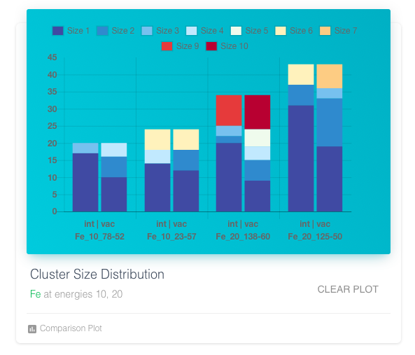
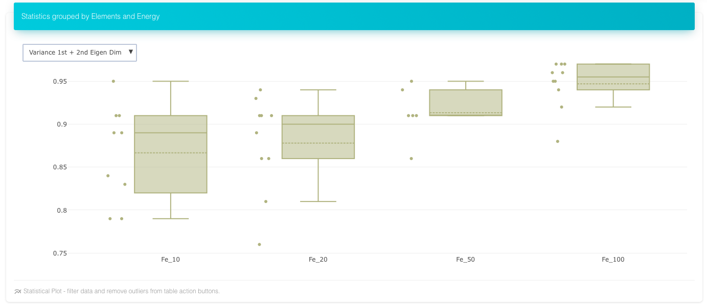
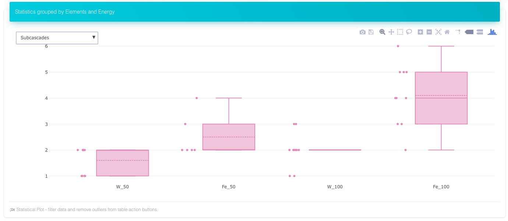
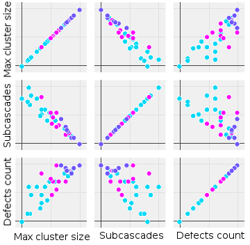

Csaransh
==================================

## What is CSaransh?

The sofware suite to post-process, explore and visualize Molecular Dynamics (MD) simulations of collision cascades.
It is an elaborate software solution for studing MD results of radiation damage simulations, starting from identifying defects from xyz file to finding correlations, visualizing subcascades to pattern matching clusters and the list goes on. There are many novel methods. The algorithms employed are fast and there is a refreshing interactive webapp to explore the results. You can check the web page for the project and read the manual to go through the different sections of the analysis. The web page shows the results for the MD [database of IAEA Challenge on Materials for Fusion 2018](https://www-amdis.iaea.org/CDB/challenge/).

We are in the process of enriching the documentation and submitting a JOSS paper on implementation.
For detailed discussion on new methods and results on classification of clusters please refer to this [paper](https://arxiv.org/abs/1811.10923).

## Affiliations and Acknowledgements

The initial version was submitted to the
[IAEA Challenge on Materials for Fusion 2018](https://challenge.iaea.org/challenges/2018-NA-Mat-Fusion) as an
entry from [Bhabha Atomic Research Center (BARC)](http://www.barc.gov.in) by Manoj Warrier, Ashok Arya, Harsh Hemani, Utkarsh Bhardwaj and Nancy Semwal. Many thanks to the team, the challenge organizers and the judges for their encouraging words.

## Installation

### Dependencies and Requirements

- platform: Linux, Mac, Windows. 
  - tested on different Linux distros and MacOS.
- gcc 5.3 or later or equivalent c++14 compiler for post-processor.
- nodejs, npm / yarn for web-interface server.
- Python 2.7, numpy, sklearn
- Modern internet browser for web-interface client.
	- tested on safari and firefox61
- Hardware: 
	- CPU: comparable to i5 or better for smooth interface. 
	- Other than the desktops or laptops, the web interface can be used from tablets and mobiles as well.

### Building C++ Post-processor.

- Go to csaransh-pp directory.
- Make a new directory `_build` or any other name. Go to this directory and run `cmake ..`.
- If on Unix based systems like Linux / Mac run `make`. If using Visual Studio on Windows, load the project / solution.

After building the application the executable `csaransh_pp` can be found in the `_build` directory. This is the main post-processor for processing xyz files. You can run `make install` to add it to the system path.

### Installing Server.

- Go the the csaransh-sever directory and run `npm install --only=production` or `yarn --prod`.

### Client App

- Nothing required here.

### Processing new data

#### Post-processor:

- You only need to run the post-processor once on the data-set.
- Run command should look something like this: `%PATH%/csaransh_pp data/*/*xyz`.
- The input file arguments are Parcas cascade xyz file(s). The .in file(input file for Parcas) must be there in the same directory where xyz files are.
- The output JSON file cascades-data.json is written in current directory.
- From the directory where cascades-data.json is located run the script `pp.py` script given in csaransh-pp directory, `python %PATH%/pp.py`. If running from some other directory where cascades-data.json is not there, pass path to cascades-data.json as the first argument to the python script as `python %PATH%/bin/pp.py %PATH%/cascades-data.json`. This script might take a few minutes before it generates `cascades-data.js` output file. If any import errors appear, install the python package using `pip install` or `easy-install` or use anaconda for python. 

#### Load new Processed data

- To view the new processed data with ready to run HTML app copy the cascades-data.js to csaransh-app/CSaransh-files/ directory.
- To view the new processed data with server app copy the cascades-data.js to csaransh-server/public/js/ directory. Or
fork the project and replace the cascades-data.js in the gh-pages branch with the new data file.

### Running the CSaransh interface

#### Server:

- Go to csaransh-server directory.
- Run `npm start` or `nodejs ./bin/www` for older node versions to start the server in default 3000 port.
- Now you can load the interface on any modern browser, type `localhost:3000` in the address bar.

#### Ready to run app:

- The only problem with this client only app is that the 3D clusters webGL plot may not be visible in some browsers, however it will load perfectly fine in app with server.

## Getting Started

When you open the app you see a clickable green header at the top, some summary information for the complete data and three panel headers that you can open by clicking.

### Table
You can filter the data from the table to find a desired cascade or range of cascades. The statistics (third panel) are done only on the filtered data. Sorting can be done by clicking on the headers. For multi-sort hold the shift key and then click. 

The filters update in the real time according to other filters to show range. For the image given below, The filter is applied on Material, Energy and 1D-variance columns, other column filters show the range of values that are there in the filtered data. We see that defects count for these constraints are between 0 to 242 in the image.

#### Column Description
1. Actions: The first button (eye) is used to view the current cascade in first and second panels viz. Visualize and View & Compare Info. The Second button (ban) is used to exclude a cascade from the statistics. This can be used to exclude outliers so that the rest of the statistics and correlations can be understood.
2. Material
3. Energy
4. PKA (theta angle)
5. PKA (phi angle)
6. Defects Count: Number of defects found in the cascade
7. Max Cluster Size: Largest sized cluster in the cascade
8. Percentage Defects in clusters
9. 1D-variance: The variance of defects in the first principle component (Eigen basis). The higher (closer to 100) it is the more linear the defects are.
10. 2D-variance: The variance of defects in the first and second principle component (Eigen basis). The higher it is the more planar the defects are.
11. Subcascades: Measure of number of extra subcascades in the cascade. Determined by density based clustering. Can be separately viewed in Visualize panel as given below.
12. Impact of biggest subcascade: Measure of how significant the second best subcascade is in relation to the biggest subcascade. It is the ration of number of defects in the two. Higher (closer to 100) denotes equally big second subcascade.

### Visualize and Find Patterns
The plots show a single cascade, its Subcascade, clusters and similar clusters in the whole database. Any cascade can be viewed by clicking on first button in the table. The name of the cascade is Material_Energy_PKAtheta_PKAphi. The name of a cluster is its unique clusterId followed by cascade name.

#### Cascade View and Cluster Shapes
The First 3D view called clusters shows the whole cascade with different colors for different clusters. The annihilated interstitial, vacancy pair can be shown, hidden or shown with less opacity (default). These annihilated pairs are useful to define the shape of the cluster, its dimensionality and hence properties (diffusion etc). Following is the same cluster with and without annihilated defects. Note that conventional Wigner-Seitz does not find annihilated defects.

*The cluster with annihilated interstitials and vacancies shows a ring structure*

*Same cluster without annihilated interstitials and vacancies shows no structure*

Clicking on a cluster of significant size (>3) selects the cluster for finding similar clusters in the whole database which is displayed in the next section below it.

#### Finding same patterns
The Cluster Comparison shows the top 5 matches from the complete database for the selected cluster from the cascade. There are different criteria for matches. Clicking on 1-5 views that cluster. The name of the cluster is cluster-id for the cluster, followed by cascade name (material_energy_theta_phi). The Eigen variance shows the dimensionality of the cluster. The clusters are plotted with their Eigen coordinates so that they can be compared one to one.

*Top five matches for the above cluster from the complete database of cascades*

#### Subcascades
The subcascade mesh shows different vacancy dense regions with different colors. The same information can be inferred from scatter plot and contour plot for vacancy. The following images show a cascade with four subcascades in different views. All these plots are in their Eigen basis (principle components) with x-axis having maximum variance, then y-axis and then z-axis.

### View and Compare Info
Clicking on the action button on the table adds the cascade information to the plots and table of this panel. For the last four selected cascades, the plots show cluster size distribution, distribution of angles and distances with reference to PKA direction and origin position. 

The tables show input information, output details and list of defects. There are also options to download and copy the input and output details. The table view can be locked to hold the info of current selected cascade unless unlocked. In this way two tables can be either used to show different information (input on one and output on one) for the same cascade or to compare the cascades with respect to a single locked one.

## Statistics
The statistics is calculated over the filtered data. So if one wants to find statistics for an element over all the energies, the filter on material column in the table can be used. Similarly, for finding and comparing statistics for different elements on same energies, the filter on energies can be used. Any filters like angles, dimensionality can be used to analyze patterns in the data.
Following are some of the statistics.

*Number of defects over energies in Fe, mouse-over the boxes shows mean, median, max etc*

*Planarity of Iron Cascades over energies, more spread out in two dimensions than third as energy increases*

*Number of subcascades in Fe and W at two energies*

*The scatter plot of each parameter over all other for Fe. The 1,0 plot shows negative correlation between the two params (viz. variance of first and second principle component). The color coding is for number of defects, which helps to see if a pair of parameters correlate to the number of defects.*

*Shows the Distance distribution of interstitials and vacancies for Fe and W at two energies.*

## Algorithms Overview

An overview of the important algorithms and novel approaches to radiation damage used in the software are briefly discussed below.

### Defects Identification

1. Using modulo arithmetic find closest point in the lattice for each atomic co-ordinate. Also, find the distance between closest point in the lattice and the atom (csaransh-pp/src/AddOffset.cpp) [jcomp16](https://doi.org/10.1016/j.jcp.2015.10.034)
2. Sort the atomic coordinates by the closest point in the lattice for each.
3. Go through the sorted list. If a lattice point is missing then mark it as vacancy. If a lattice point is repeated then mark the more distant atom as interstitial. While marking the distant point as interstitial, also mark the other repeated atom as annihilated interstitial and lattice point as annihilated vacancy if the distance between the two is greater than some threshold.

The algorithm has time-complexity of O(N(logN)).

### Vacancy and Interstitial Clusters

We use union find datastructure to keep the clusters efficiently. The annihilated interstitials and vacancies also contribute to the clustering, so that crowdions, complex ring structures etc. can be grouped in the same cluster.

### Features for Pattern Matching

For each cluster we find histograms of the angles of each triplets in the cluster, histogram of pair of distances and histogram of adjacency of each node. The techniques are taken from graph theory and topography. We also define the coordinates of the clusters in their Eigen basis so that different distance measures like Hausdorff distance etc. can be used. However, the much efficient histogram matching especially for angles is found to be effective for matching clusters and classifying them. The histogram matching is also resilient to noise compared to strict distance measures.

### Comparison of Features

We found different histogram distances to be equally effective. We are using Chi-square distance.

### Dimensionality Reduction

We are using principle component analysis with singular value decomposition, to find the Eigen like basis and idea of dimensionality for cascades, subcascades as well as clusters.

### Subcascades

We are using DBSCAN algorithm for vacancies to find the vacancy density clusters. We find the impact of a subcascade as the number of vacancies in the cluster. We found the density based clustering with some obvious tweaking (ignoring very less impact subcascades) to be a good measure of subcascading and its impact measure.

## Contributions

Contributions are welcome in the form of suggestions, ideas, code, bug fixes, constructive feedback. The current direction is to improve the efficiency of the interface using React's DOM unmounting effectively and adding more methods to pattern matching and subcascading and finding out how they relate to number of defects, other cascades etc.
We hope the current software can help explore many new ideas but we believe that it is just the beginning.

## Citation

You can use this [paper](https://arxiv.org/abs/1811.10923) for citation until we submit a JOSS paper on the implementation for the use of code, methods or results. Also, please consider to give the link to the github project page.
