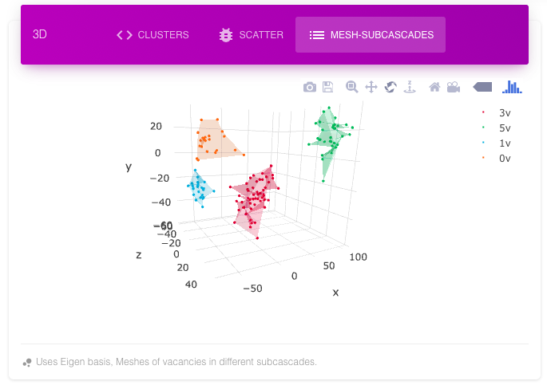
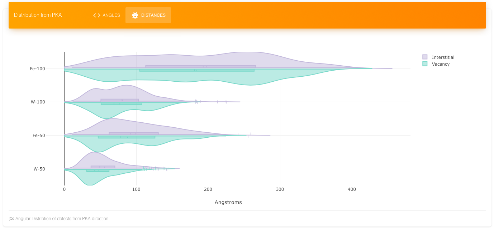

# Summary

The micro-structural properties of the materials change due to irradiation. The defects formed during the displacement cascades caused by irradiation are primary source of radiation damage [@Stoller; @BjorkasKai]. The number of primary defects produced, defect cluster size distribution and defect cluster structures after a collision cascade can be studied using Molecular Dynamics simulations. These results determine the long term evolution of the micro-structural changes in the material [@Stoller; @GOLUBOV; @SINGH; @OSETSKY; @BECQUART]. The properties studied using Molecular Dynamics (MD) simulations can be used in higher scale radiation damage models like Monte Carlo methods and rate theories etc. [@OSETSKY; @BECQUART].

``CSaransh`` is a software suite to explore the Molecular Dynamics simulations of collision cascades. It includes post-processors to identify defects, characterize and classify cluster-structures, find number of sub-cascades etc. and a single page web-application (SPA) as GUI that provides interactive visualizations and charts such as:

- Different 3D-visualizations for a cascade including heat-maps, sub-cascades view, clusters-view etc. 
- Interactive tool for pattern matching of cluster structures across the database.
- Charts for comparison of properties of cascades such as cluster size distribution, spatial and angular distribution of defects from primary knock-on position etc. 
- Statistical analysis over elements and energies and correlations for all the cascades for the properties like number of defects, dimensionality of cascades, number of sub-cascades etc.
- Interactive tool for exploring the classes identified for the clusters found.

With the combination of efficient algorithms, unsupervised machine learning and modern interactive GUI with 3D visualizations the application helps in exploring different aspects of collision cascades qualitatively as well as quantitatively. The study can reveal many interesting correlations and patterns specific to different materials, energy ranges etc. We use efficient algorithm to identify defects from big MD simulation files. We use statistics and various unsupervised machine learning algorithms like HDBSCAN [@HDBSCAN], UMAP [@UMAP], PCA etc. to find various features such as identification of sub-cascades, characterization and classification of cluster structures, identifying dimensionality of cascades and clusters.

The suite uses different tools for various tasks according to suitability. C++14 is used to efficiently post-process big simulation outputs. Python is used to add properties found using machine learning algorithms. Html with React-js[@reactjs] is used to develop the single page application. The charting libraries like chart-js [@chartjs] and plotly.js [@plotlyjs] are used for the different charts. JSON is used as the common data format between post-processors and GUI.

The application shows results on data from IAEA challenge as the default view, however any simulations data can be then loaded to study and explore. The application is planned to be included for the exploration of CascadesDB database[@CascadesDB].

The ``CSaransh`` application was an entry in the IAEA challenge on materials for fusion, 2018 [@IAEA-challenge] and received critical acclaim from the judges of the contest. The description of the new algorithms for identification of defects and classification of clusters can be found in arxiv preprint paper [@ubclasses]. A talk in MoD-PMI 2019 workshop [@modpmi] is scheduled on the same topic.

# Screenshots

*Main table with reactive filters, sorting, selection etc. The cascades of interest can be chosen here using the first (view) action button placed in first column of each row. Filters and sorting can be applied using the sliders for energy, directions, defects count, etc. The statistics are shown for only the filtered rows. To exclude a single row from the statistics, the second action button for that row can be toggled.*

*Section to chose and compare similar clusters. The cluster of interest can be chosen from the cascade view or the list on the left. The right side shows top five clusters from the complete database of cascades that match the shape of the cluster on the left. There are different matching criteria to choose from. Each of the matches can be separately viewed by clicking on the choices displayed on the bottom of the right section along with the (dis-)similarity metric from the cluster on left and dimensionality.*

*A high energy cascade can be composed of different sub-cascades or frangments. The sub-cascades are found using the DBSCAN algorithm on the vacancies created in the cascade.*

*Scatter view and heat-map view for the same cascade. Heat map can be viewed for the vacancies, interstitials and both. It represents the density of defects. The scatter view and specifically heat map for vacancies can give a qualitative idea of the sub-cascading and range of the cascade.*

*Cluster size distribution of the cascades selected from the main table.*

*Number of defects over different energies in Fe, On mouse-over the boxes show mean, median, max etc. Box plot for different properties can be plotted using the drop down menu. The statistics are aggregated for the rows filtered from the main table.*

*The scatter plot of each parameter against every other is plotted that helps in checking correlations and trends between the parameters such as number of defects, number of sub-cascades, in cascade clustering fraction etc. The color coding is for number of defects, which helps to see if a pair of parameters correlate to the number of defects.*

*Shows the Distance distribution of interstitials and vacancies from the PKA (primary knock-on atom) origin for Fe and W at two different energies.*

*The interactive plot shows the classification of cluster shapes on the left, each class having its own color. Each point represents a defect cluster. The 2-dimensional plot is generated using the dimensionality reduction algorithms UMAP[@UMAP] and t-SNE[@TSNE] which place similar defect clusters nearby. The clusters are classified using HDBSCAN[@HDBSCAN] unsupervised algorithm. Any cluster shape can be viewed on the right by clicking on a point on the left.*

# References
